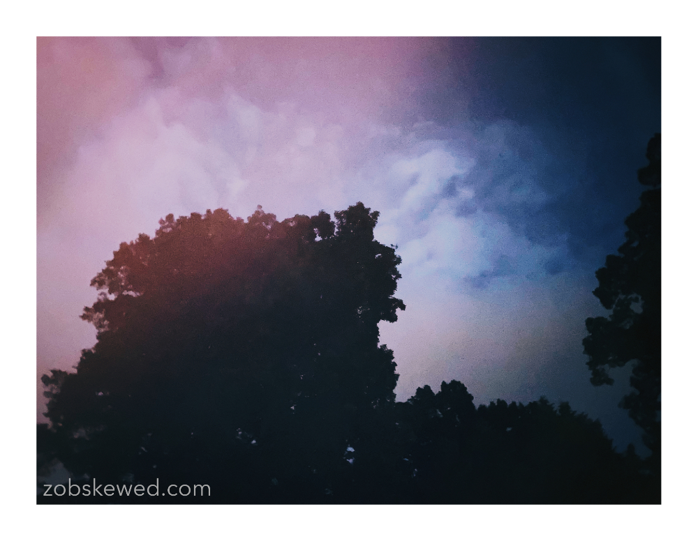

[zobskewed](http://zobskewed.com)
 
Photographer / Author

Email [zobskewed@gmail.com](mailto:zobskewed@gmail.com)

<b>On Becoming the Person Your Team Needs You to Be: Standing Out and Leading in Tech and Beyond</b>

This is a self-published book, available in paperback. It was published in April, 2022. 

[Click for More Information or to Buy via Amazon](http://www.amazon.com/dp/B09WQDWTZJ/ref=nosim?tag=zobskewed01-20)

First one to find the spelling error wins!

Babbling on Twitter [@zobskewed](http://twitter.com/zobskewed)

<!---->

<b>My Philosophy on Photography</b>

Photography for me is all about capturing the moment that appears before me. I'm not looking to setup an elaborate scene. I take what is presented and capture it as quickly and unobtrusively as possible. Because of this, my camera and lens must be minimal, elegant, and not get in the way.

I recently purchased a Ricoh GR3x because it is the perfect small, quick, camera - at 40mm it's a sweet spot between my two favorite focal lengths. I also use a Leica M10-P because it is one of the ultimate minimalistic cameras. Up until recently I used a Fujifilm X-Pro3 (because it is inexpensive, contains some wonderful creative controls, and allows you to adapt to M-mount lenses).  In the past, I've also used a Leica Q2 (my first Leica) but sold it because the M10-P really spoke to me and was closer to the type of experience I was looking for in a camera.

I pair the M10-P with the Voigtlander 35mm f/1.4 Nokton Classic (MC) or the Voigtlander 50mm f/1.5 ASPH II Nokton Vintage Line (MC). I never use a flash because I find natural light much more pleasing. I never use a tripod because I enjoy the connection between my hands and the camera at the point of taking the photo. I find this setup and process to be the shortest distance between seeing a scene and capturing it.

I'm partial to small prime lenses - 35mm and 50mm. I work in color and black & white. I almost always shoot straight to uncompressed JPG and very rarely edit a DNG/RAW file. After the photo is taken, I (almost immediately) transfer the best to my iPhone, perform minimal edits in Darkroom (or similar app) to adjust contrast or highlights or shadows, maybe add some gentle vignetting or noise. If it takes longer than 30 seconds I'm overthinking it. For me, photography needs to be instant and with as little friction as possible. It should be like an improvised melody - you get very little time to choose the next note - it just has to happen - and once it does, it's gone - you move on to the next. Imperfection is perfectly acceptable, in fact, desired - that's where the magic happens.

Once complete, I tend to post at least one to Instagram to obtain my social media approval. I try not to think that 100 likes really means ~8 billion people don't care at all about my art. :-)

Photography on Instagram [@zobskewed](http://instagram.zobskewed.com/)

<!--
[Visit Amazon](https://www.amazon.com/?&_encoding=UTF8&tag=zobskewed-20&linkCode=ur2&linkId=89d99b8bc966b26db86a1e808a43a895&camp=1789&creative=9325)
-->
